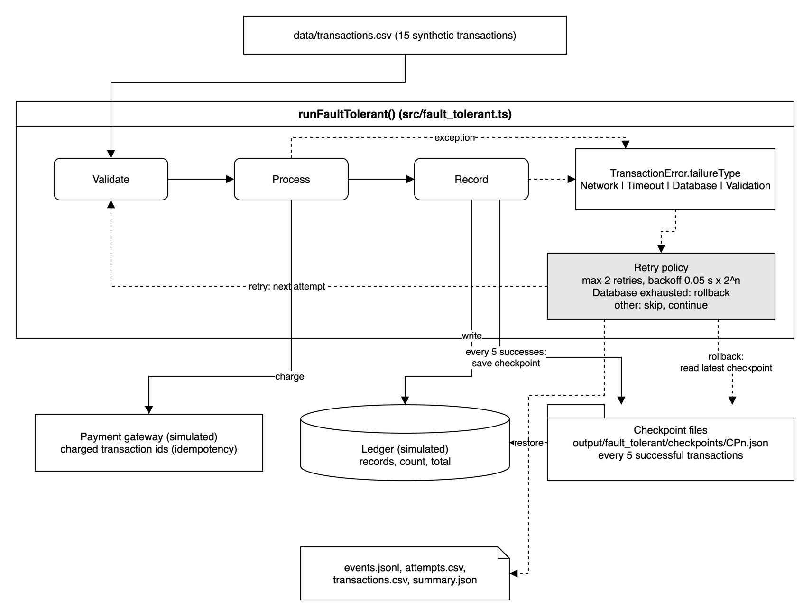
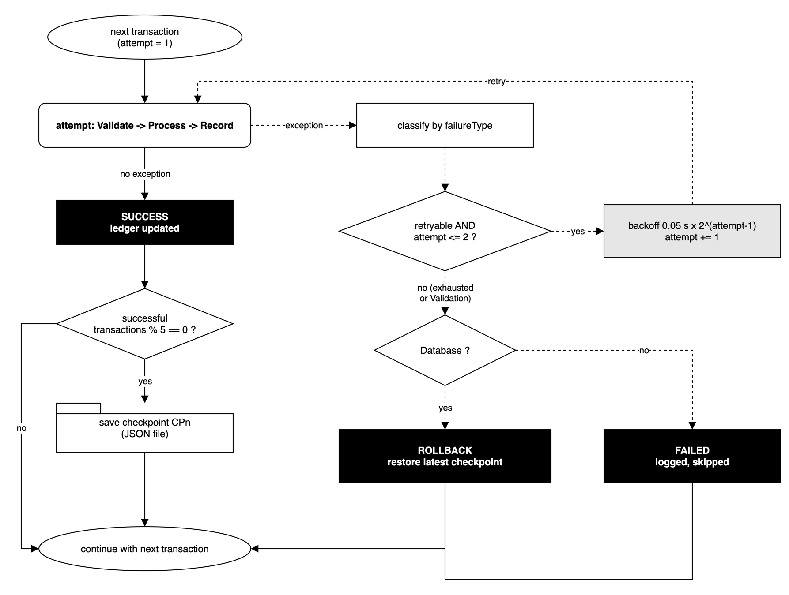
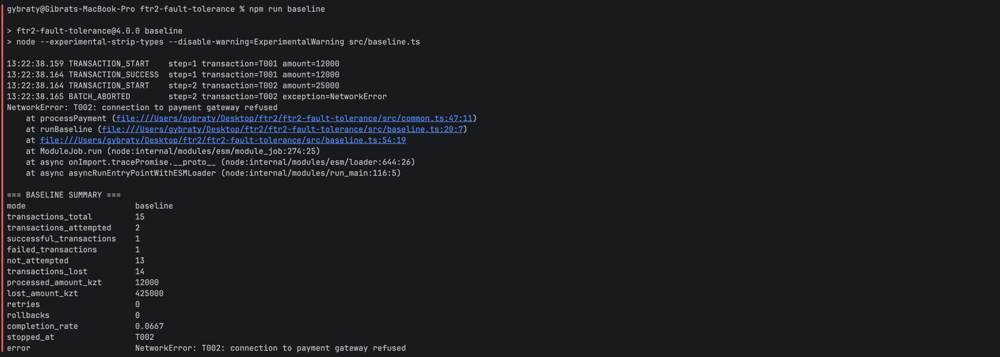
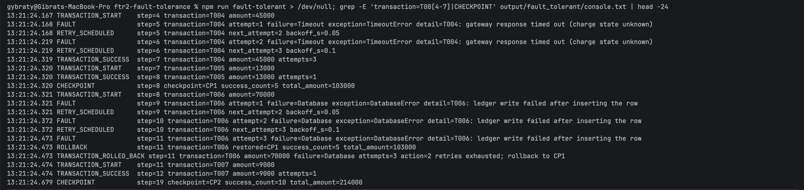
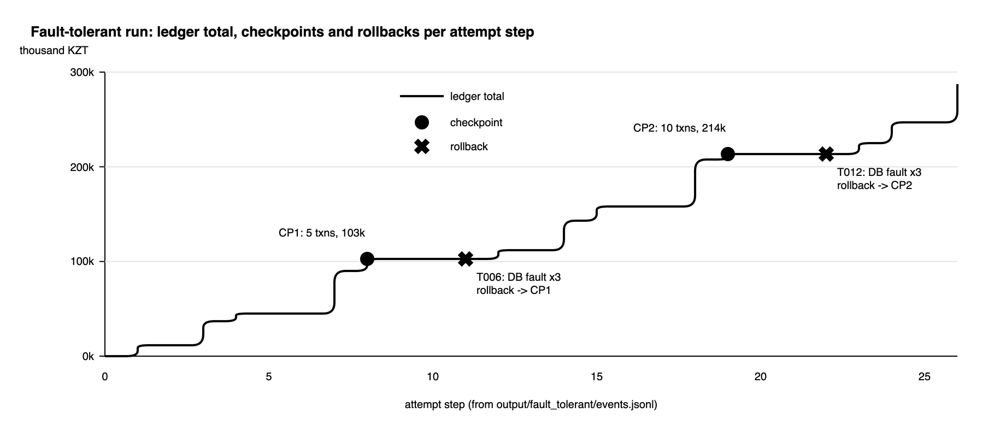
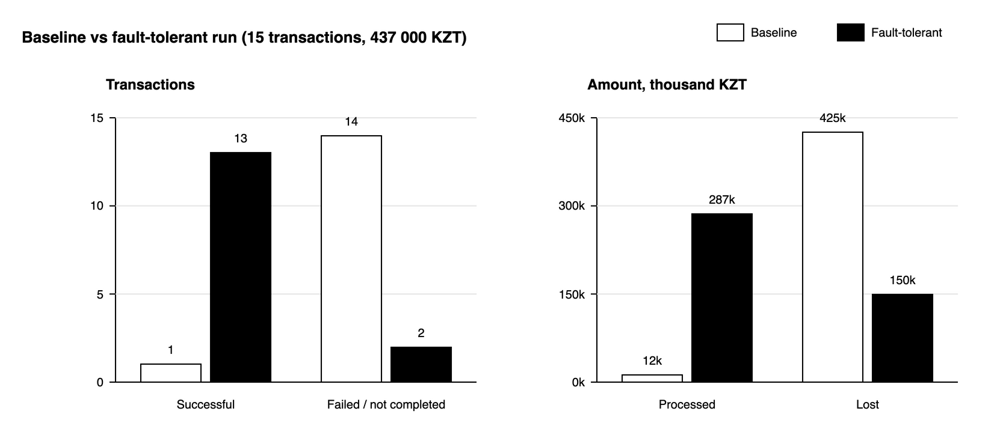
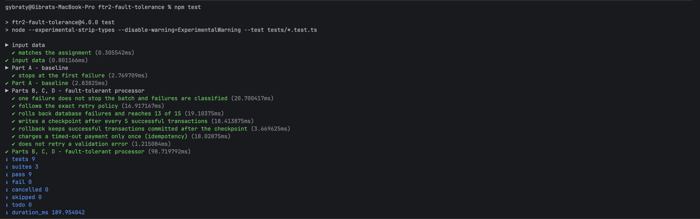
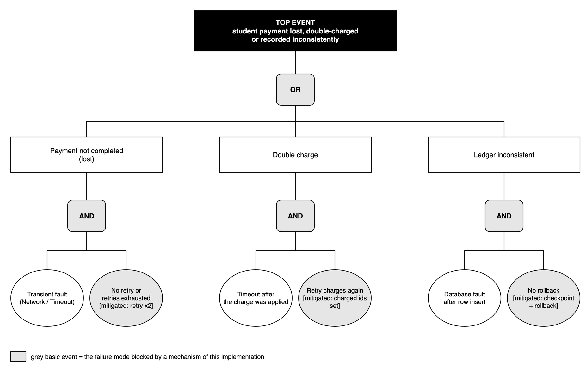
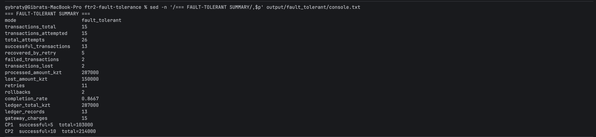

# Assignment 2 — Software Fault-Tolerant Design

**Technical report: fault-tolerant processing of student payment transactions**

*All operational data are synthetic educational data.*

| Item | Value |
|---|---|
| Student | Gibrat |
| Date of run | 2026-09-29 13:21:25 UTC |
| Source code version | https://github.com/gybraty/ftr2-fault-tolerance, git tag **v4.0.0** |
| Run-generated evidence | `output/` — produced by `./run_all.sh` (see `output/run_manifest.json` for the SHA-256 of every source file) |
| Runtime | TypeScript on Node.js v22.15.0 (built-in type stripping, no runtime dependencies); diagrams and charts: draw.io (`docs/make_figures.cjs`) |
| Source files | `src/common.ts` (shared model) · `src/baseline.ts` (Part A) · `src/fault_tolerant.ts` (Parts B–D) · `src/compare.ts` (Part E) · `tests/fault_tolerance.test.ts` |
| Language note | The assignment text says "Python processor"; this submission implements the same design in TypeScript (Node.js). Every mechanism, table and log required by the assignment is produced. |

# 0. Design overview

Every transaction runs through **Validate → Process → Record**. Each failure type is injected at the step where it happens in practice:

| Failure | Step | Exception (`TransactionError.name`) | What happens in the simulation | Recovery |
|---|---|---|---|---|
| Network | Process | `NetworkError` | Connection to the payment gateway refused — nothing was charged. | retry |
| Timeout | Process | `TimeoutError` | The charge is applied, then the response is lost. | retry (the gateway remembers charged ids, so no second charge) |
| Database | Record | `DatabaseError` | The ledger row is inserted, then the write fails (partial write). | retry; when exhausted: rollback to the latest checkpoint |
| Validation | Validate | `ValidationError` | Malformed id or non-positive amount. | never retried |

The fault table of the assignment is encoded once in `FAULT_RULES` (`src/common.ts`): `true` = the attempt fails, index 0 = initial attempt. `attemptFails(transaction, attemptNumber)` reads it. The recovery constants (`MAX_RETRIES`, `BACKOFF_SECONDS`, `CHECKPOINT_EVERY`) are at the top of `src/fault_tolerant.ts`, so the fault model and the recovery rules can be changed independently.

`src/common.ts`, lines 15-20:

```ts
export const FAULT_RULES: Record<FailureType, boolean[]> = {
  None: [false],
  Network: [true, false],
  Timeout: [true, true, false],
  Database: [true, true, true],
};
```

`src/fault_tolerant.ts`, lines 8-10:

```ts
export const MAX_RETRIES = 2;
export const BACKOFF_SECONDS = 0.05;
export const CHECKPOINT_EVERY = 5;
```



*Figure 1. Architecture of the fault-tolerant processor (docs/diagrams/diag_architecture.drawio).*



*Figure 2. Per-transaction control flow: classification, retry with backoff, rollback (docs/diagrams/diag_txn_flow.drawio).*

# Part A — Baseline implementation

`runBaseline()` (`src/baseline.ts:L6-L51`) loops over the transactions and calls `validateTransaction()`, `processPayment()` and `recordTransaction()` with **no try/catch inside the loop, no retry and no checkpoint**. The first injected fault (T002, `NetworkError`) leaves the loop and the batch ends. The only handler is outside the loop: it records how far the batch got and the process exits with status 1.

| Metric | Result |
|---|---|
| Transactions attempted | 2 (T001, T002) |
| Successful transactions | 1 (T001) |
| Transactions lost | 14 (T002 failed + 13 never processed: T003–T015) |
| Processed amount (KZT) | 12 000 |
| Lost amount (KZT) | 425 000 (= 437 000 − 12 000) |

*Table A. Baseline metrics — source: `output/baseline/summary.json`*

Run-generated console capture (`output/baseline/console.txt`, first lines):

```text
13:21:24.034 TRANSACTION_START    step=1 transaction=T001 amount=12000
13:21:24.037 TRANSACTION_SUCCESS  step=1 transaction=T001 amount=12000
13:21:24.037 TRANSACTION_START    step=2 transaction=T002 amount=25000
13:21:24.037 BATCH_ABORTED        step=2 transaction=T002 exception=NetworkError
NetworkError: T002: connection to payment gateway refused
    at processPayment (file:///Users/gybraty/Desktop/ftr2/ftr2-fault-tolerance/src/common.ts:47:11)
...
```



*Figure 3. Baseline console output: the batch aborts at T002, exit code 1.*

### Template section 1 — Baseline implementation

| Required content | Student response / evidence |
|---|---|
| **Summary** | Sequential Validate → Process → Record loop with no fault handling. The first failure (T002, Network) terminates the whole batch: 1 of 15 transactions completes (6.67%), 14 are lost although only 7 of them had a fault at all. |
| **Evidence / calculation / artifact reference** | `output/baseline/summary.json`; `output/baseline/events.jsonl` (BATCH_ABORTED at T002); `output/baseline/console.txt` (stack trace, exit code 1). Lost amount = 437 000 − 12 000 = 425 000 KZT. Unit test *Part A - baseline › stops at the first failure*. |
| **Student-specific decision or observation** | I count 'transactions lost' as failed + never attempted (1 + 13 = 14), because a payment that was never processed is lost for the student just like a failed one. Observation: 7 of the 14 lost payments (T003, T005, T007, T009, T011, T013, T014) had no fault at all — they are collateral loss caused only by the missing isolation between transactions. |

# Part B — Exception handling

Each attempt of a transaction runs inside `try/catch` (`src/fault_tolerant.ts:L78-L118`). Every failure is a `TransactionError` whose `failureType` field (Network, Timeout, Database, Validation) classifies it; `name` becomes `NetworkError`, `TimeoutError`, … The catch block writes a structured `FAULT` event to `events.jsonl`, decides between retry, rollback and skip, records the final status and the loop continues with the next transaction. Unknown errors (not `TransactionError`) are re-thrown, because they are bugs, not faults.

`src/common.ts`, lines 27-35:

```ts
export class TransactionError extends Error {
  failureType: "Validation" | "Network" | "Timeout" | "Database";

  constructor(failureType: "Validation" | "Network" | "Timeout" | "Database", message: string) {
    super(message);
    this.failureType = failureType;
    this.name = `${failureType}Error`;
  }
}
```

`src/fault_tolerant.ts`, lines 92-96:

```ts
      } catch (caught) {
        if (!(caught instanceof TransactionError)) throw caught;
        lastException = caught.name;
        log("FAULT", { step, transaction: transaction.id, attempt: attemptNumber, failure: caught.failureType, exception: caught.name, detail: caught.message });
        const retryable = caught.failureType !== "Validation";
```

Example structured log record (`output/fault_tolerant/events.jsonl`):

```json
{
  "timestamp": "2026-09-29T13:21:24.321Z",
  "event": "FAULT",
  "step": 9,
  "transaction": "T006",
  "attempt": 1,
  "failure": "Database",
  "exception": "DatabaseError",
  "detail": "T006: ledger write failed after inserting the row"
}
```

| Transaction | Failure | Exception | Recovery action | Final status |
|---|---|---|---|---|
| T002 | Network | `NetworkError` | retry x1 | SUCCESS (after retry 1) |
| T004 | Timeout | `TimeoutError` | retry x2 | SUCCESS (after retry 2) |
| T006 | Database | `DatabaseError` | 2 retries exhausted; rollback to CP1 | ROLLED_BACK |
| T008 | Network | `NetworkError` | retry x1 | SUCCESS (after retry 1) |
| T010 | Timeout | `TimeoutError` | retry x2 | SUCCESS (after retry 2) |
| T012 | Database | `DatabaseError` | 2 retries exhausted; rollback to CP2 | ROLLED_BACK |
| T015 | Network | `NetworkError` | retry x1 | SUCCESS (after retry 1) |

*Table B. Exception handling — source: `output/fault_tolerant/transactions.csv`.*

Result: all 15 transactions are attempted, the batch never stops. 13 succeed, 2 end as ROLLED_BACK.

### Template section 2 — Exception handling

| Required content | Student response / evidence |
|---|---|
| **Summary** | One error class `TransactionError` with a `failureType` field classifies every failure; each attempt is wrapped in try/catch, the failure is logged as a JSON event, handled (retry / rollback / skip) and the batch continues. |
| **Evidence / calculation / artifact reference** | `src/fault_tolerant.ts:L78-L118` (attempt loop with try/catch), `src/common.ts:L27-L35` (classification). Logs: `output/fault_tolerant/events.jsonl`, `transactions.csv`. Test *one failure does not stop the batch and failures are classified*. |
| **Student-specific decision or observation** | The handler decides from the `failureType` field, not from the message text. A Validation error is classified as permanent and is never retried; only Network, Timeout and Database are retried. Errors that are not `TransactionError` are re-thrown on purpose: swallowing a real bug would hide it. |

# Part C — Retry mechanism

The retry policy implements the given fault table exactly: **maximum 2 retries** after the initial attempt, exponential backoff `0.05 s × 2^(attempt−1)` (0.05 s, then 0.10 s), retry only for Network, Timeout and Database.

| Failure | Initial attempt | Retry 1 | Retry 2 | Final result | Attempts / retries per txn | Observed in log |
|---|---|---|---|---|---|---|
| Network | Fail | Success | — | Success | 2 / 1 | T002, T008, T015: SUCCESS after retry 1 |
| Timeout | Fail | Fail | Success | Success | 3 / 2 | T004, T010: SUCCESS after retry 2, charged once |
| Database | Fail | Fail | Fail | Rollback | 3 / 2 | T006, T012: ROLLED_BACK |

Totals from the run: **26 attempts** for 15 transactions, **11 retries** (3×1 Network + 2×2 Timeout + 2×2 Database = 11), **5 transactions recovered** by retry.

`src/fault_tolerant.ts`, lines 96-105:

```ts
        const retryable = caught.failureType !== "Validation";
        if (retryable && attemptNumber <= MAX_RETRIES) {
          const delaySeconds = backoffSeconds * 2 ** (attemptNumber - 1);
          addAttempt(transaction, attemptNumber, caught.failureType, `retry scheduled (backoff ${delaySeconds}s)`, "FAIL");
          log("RETRY_SCHEDULED", { step, transaction: transaction.id, next_attempt: attemptNumber + 1, backoff_s: delaySeconds });
          await sleep(delaySeconds * 1000);
          retries += 1;
          attemptNumber += 1;
          continue;
        }
```

Attempt log (automatically generated, `output/fault_tolerant/attempts.csv`, rows of the 7 faulted transactions; time is UTC, the step counter is global across the batch):

| Step / timestamp | Transaction | Attempt | Failure | Action | Result |
|---|---|---|---|---|---|
| #2 13:21:24.115 | T002 | initial | Network | retry scheduled (backoff 0.05s) | FAIL |
| #3 13:21:24.167 | T002 | retry 1 | - (fault cleared) | commit | SUCCESS |
| #5 13:21:24.168 | T004 | initial | Timeout | retry scheduled (backoff 0.05s) | FAIL |
| #6 13:21:24.219 | T004 | retry 1 | Timeout | retry scheduled (backoff 0.1s) | FAIL |
| #7 13:21:24.319 | T004 | retry 2 | - (fault cleared) | commit | SUCCESS |
| #9 13:21:24.321 | T006 | initial | Database | retry scheduled (backoff 0.05s) | FAIL |
| #10 13:21:24.372 | T006 | retry 1 | Database | retry scheduled (backoff 0.1s) | FAIL |
| #11 13:21:24.473 | T006 | retry 2 | Database | 2 retries exhausted; rollback to CP1 | ROLLED_BACK |
| #13 13:21:24.474 | T008 | initial | Network | retry scheduled (backoff 0.05s) | FAIL |
| #14 13:21:24.524 | T008 | retry 1 | - (fault cleared) | commit | SUCCESS |
| #16 13:21:24.525 | T010 | initial | Timeout | retry scheduled (backoff 0.05s) | FAIL |
| #17 13:21:24.576 | T010 | retry 1 | Timeout | retry scheduled (backoff 0.1s) | FAIL |
| #18 13:21:24.678 | T010 | retry 2 | - (fault cleared) | commit | SUCCESS |
| #20 13:21:24.679 | T012 | initial | Database | retry scheduled (backoff 0.05s) | FAIL |
| #21 13:21:24.731 | T012 | retry 1 | Database | retry scheduled (backoff 0.1s) | FAIL |
| #22 13:21:24.833 | T012 | retry 2 | Database | 2 retries exhausted; rollback to CP2 | ROLLED_BACK |
| #25 13:21:24.834 | T015 | initial | Network | retry scheduled (backoff 0.05s) | FAIL |
| #26 13:21:24.885 | T015 | retry 1 | - (fault cleared) | commit | SUCCESS |

*Table C. Retry attempt log — source: `output/fault_tolerant/attempts.csv` (all 26 attempts are in the file; the gap of ~50 ms / ~100 ms between attempts is the backoff).*



*Figure 4. Console excerpt of the fault-tolerant run: retries of T004, checkpoint CP1, three DB faults of T006 and the rollback.*

### Template section 3 — Retry mechanism

| Required content | Student response / evidence |
|---|---|
| **Summary** | Retry up to 2 times with exponential backoff; the fault table produces exactly 2 attempts for Network, 3 for Timeout and 3 for Database. 11 retries recover 5 of the 7 faulted transactions; both Database transactions exhaust their retries and go to rollback. |
| **Evidence / calculation / artifact reference** | `output/fault_tolerant/attempts.csv` (26 rows), `events.jsonl` (RETRY_SCHEDULED events with backoff_s). Code: `src/fault_tolerant.ts` line 97 (retry decision), line 98 (backoff). Test *follows the exact retry policy* asserts 2/3/3 attempts, 11 retries, 26 attempts. |
| **Student-specific decision or observation** | Timeout is modelled as an ambiguous fault: the money is charged before the response is lost. The simulated gateway keeps the set of charged transaction ids, so the retries of T004/T010 do not charge again (`gateway_charges = 15` for 15 payments, test *charges a timed-out payment only once*). Without that set every Timeout retry would be a double charge. |

# Part D — Checkpoint and rollback

After every successful transaction the processor checks `ledger.successfulTransactions % CHECKPOINT_EVERY === 0` and, when true, `saveCheckpoint()` (`src/fault_tolerant.ts:L28-L41`) writes `output/fault_tolerant/checkpoints/CPn.json`.

**State saved** in each checkpoint: name, timestamp, number of successful transactions, total amount, the list of committed transaction ids and the full ledger (records, count, total).

`src/fault_tolerant.ts`, lines 28-41:

```ts
  function saveCheckpoint() {
    const name = `CP${checkpoints.length + 1}`;
    const checkpoint = {
      name,
      created_at: new Date().toISOString(),
      successful_transactions: ledger.successfulTransactions,
      total_amount_kzt: ledger.totalAmount,
      committed_ids: ledger.records.map((record) => record.id).join(";"),
    };
    writeJson(`${checkpointDirectory}/${name}.json`, { ...checkpoint, ledger });
    checkpoints.push(checkpoint);
    resultsAtLastCheckpoint = transactionResults.length;
    log("CHECKPOINT", { step, checkpoint: name, success_count: ledger.successfulTransactions, total_amount: ledger.totalAmount });
  }
```

| Checkpoint | Successful transactions | Total amount (KZT) | State saved |
|---|---|---|---|
| CP1 | 5 | 103 000 | committed ids T001, T002, T003, T004, T005; full ledger in `checkpoints/CP1.json` |
| CP2 | 10 | 214 000 | committed ids T001, T002, T003, T004, T005, T007, T008, T009, T010, T011; full ledger in `checkpoints/CP2.json` |
| CP3 | — | — | not reached: the run ends with 13 successful transactions, CP3 would be written at 15 |

*Table D. Checkpoints — source: `output/fault_tolerant/checkpoints.csv` and `output/fault_tolerant/checkpoints/CP*.json`.*

## Rollback procedure

When a `DatabaseError` has exhausted its 2 retries, `rollback()` runs:

1. Read the latest checkpoint file from disk and restore its ledger (if no checkpoint exists yet, restore the empty ledger).
2. Re-apply the successful transactions that were committed after that checkpoint, so rollback never throws away good payments.
3. Log a `ROLLBACK` event, mark the transaction ROLLED_BACK and continue with the next one.

`src/fault_tolerant.ts`, lines 43-58:

```ts
  function rollback(transaction: Transaction): string {
    const latest = checkpoints[checkpoints.length - 1];
    const restoredLedger: Ledger = latest
      ? JSON.parse(fs.readFileSync(`${checkpointDirectory}/${latest.name}.json`, "utf8")).ledger
      : createLedger();
    Object.assign(ledger, restoredLedger);
    for (const result of transactionResults.slice(resultsAtLastCheckpoint)) {
      if (String(result.final_status).startsWith("SUCCESS")) {
        recordTransaction(ledger, { id: String(result.transaction), amount: Number(result.amount_kzt), failureType: "None" }, false);
      }
    }
    rollbacks += 1;
    const restored = latest ? String(latest.name) : "empty state";
    log("ROLLBACK", { step, transaction: transaction.id, restored, success_count: ledger.successfulTransactions, total_amount: ledger.totalAmount });
    return restored;
  }
```

| Failed transaction | Restored checkpoint | Ledger after rollback |
|---|---|---|
| T006 | CP1 | 5 transactions, 103 000 KZT |
| T012 | CP2 | 10 transactions, 214 000 KZT |

*Table D2. Rollback events — source: `output/fault_tolerant/events.jsonl` (event = ROLLBACK).*

In the given data both DB failures happen right after a checkpoint (T006 after CP1, T012 after CP2), so nothing has to be re-applied. The re-apply path is covered by the test *rollback keeps successful transactions committed after the checkpoint*: 7 good transactions, then a DB failure at T008 → restore CP1 (5 transactions), re-apply T006 and T007 → 8 of 9 in the ledger.



*Figure 5. Ledger total per attempt step in the fault-tolerant run, with checkpoints and rollbacks (built from output/fault_tolerant/events.jsonl).*

### Template section 4 — Checkpoint and rollback

| Required content | Student response / evidence |
|---|---|
| **Summary** | CP1 = 5 transactions / 103 000 KZT, CP2 = 10 transactions / 214 000 KZT (CP3 would need 15 successes; the run ends at 13). T006 rolls back to CP1 and T012 to CP2; the partial ledger row of the failed transaction is discarded and the ledger ends with exactly the 13 successful records. |
| **Evidence / calculation / artifact reference** | `src/fault_tolerant.ts:L28-L41` (`saveCheckpoint`), `src/fault_tolerant.ts:L43-L58` (`rollback`); `output/fault_tolerant/checkpoints/CP1.json`, `CP2.json`; `checkpoints.csv`; ROLLBACK events in `events.jsonl`. Tests: *writes a checkpoint after every 5 successful transactions*, *rolls back database failures and reaches 13 of 15*, *rollback keeps successful transactions committed after the checkpoint*. |
| **Student-specific decision or observation** | Rollback reads the checkpoint back from the JSON file instead of keeping a copy in memory, so the same file would also work for recovery after a process crash. Because a plain restore would discard payments committed after the checkpoint, rollback re-applies them from the results list — this is the one step beyond the simplest 'restore and continue'. |

# Part E — Before/after analysis

| Metric | Baseline | Fault-tolerant | Improvement |
|---|---|---|---|
| Successful transactions | 1 | 13 | +12 (13×) |
| Failed transactions | 14 (1 failed + 13 never processed) | 2 (T006, T012 rolled back) | −12 (85.71% fewer) |
| Lost amount | 425 000 KZT | 150 000 KZT | −275 000 KZT (64.71% less) |
| Retries | 0 | 11 | +11 (5 transactions recovered) |
| Rollbacks | 0 | 2 | +2 (ledger stays consistent) |
| Completion rate | 6.67% | 86.67% | +80 pp |

*Table E. Before/after comparison — generated by `src/compare.ts` into `output/comparison.md` / `comparison.json`*



*Figure 6. Baseline vs fault-tolerant run.*

## Answers to the questions

### 1. Recovery improvement

Completion rate: baseline 1/15 = 6.67%, fault-tolerant 13/15 = 86.67%.

**Recovery improvement = 86.67% − 6.67% = +80 percentage points** (13 / 1 = 13× more successful transactions). Of the 7 faulted transactions, 5 are recovered (71.43%); the 2 Database ones fail safely (rolled back).

### 2. Transaction-loss reduction

**By count: (14 − 2) / 14 = 85.71%.** By amount: (425 000 − 150 000) / 425 000 = **64.71%**. The amount reduction is lower than the count reduction because the two remaining failures are the two largest payments (70 000 and 80 000 KZT).

### 3. Which mechanism contributed most?

**Exception handling** contributes most by count: it isolates each transaction, so the 13 transactions after T002 are processed at all (the baseline never reached them). **Retry** contributes most by recovered faults: it turns all 5 Network and Timeout failures into successes (+191 000 KZT). **Checkpoint/rollback** adds no completed transactions, but keeps the ledger correct after the two Database failures: without it the partial rows of T006 and T012 would stay in the ledger.

### 4. When is retry unsafe or inappropriate?

- **Non-idempotent operations**, especially after a timeout, where the first attempt may already have succeeded: a plain retry charges the student twice. My gateway keeps the set of charged ids for this reason.
- **Permanent errors**: validation failure, insufficient funds, declined card, fraud rejection. Retrying cannot change the outcome; `ValidationError` is never retried.
- **When the previous attempt left partial state** that the retry builds on (the Database case): retry alone repeats the partial write; rollback is needed.
- **When the dependency is down for long**: unlimited or immediate retries create a retry storm; use a small retry budget and backoff, as here (max 2, exponential).

### 5. Why is rollback required for database failure?

The Record step is a multi-step write: insert the row, then update the totals. A database fault in the middle leaves a **partial write** (the row exists, the totals do not include it). Retrying does not help when the fault persists (3 failures in the table), and simply skipping the transaction keeps the corrupted state and lets later transactions build on it. Rollback restores the last known-good state (CP1 / CP2) so the ledger contains only fully recorded transactions: 13 records, 287 000 KZT, exactly the successful ones.

### 6. Why is idempotency important in student payment processing?

Retries, timeouts, double clicks on 'Pay' and re-submitted batch files all deliver the **same payment more than once**. Without idempotency each delivery would charge the student again — a direct financial harm and a reconciliation problem for the university. In my implementation the gateway remembers charged transaction ids: T004 and T010 time out after the charge, are retried twice, and are charged once (`gateway_charges = 15` for 15 payments).

### Template section 5 — Before/after analysis

| Required content | Student response / evidence |
|---|---|
| **Summary** | Successful 1 → 13, failed 14 → 2, lost amount 425 000 → 150 000 KZT, completion 6.67% → 86.67% (+80 pp), 11 retries and 2 rollbacks. |
| **Evidence / calculation / artifact reference** | `output/comparison.md` / `comparison.json` (generated by `src/compare.ts` from the two summaries); figure `docs/figures/fig_before_after.png`. Calculations: +80 pp; 13×; (14−2)/14 = 85.71%; (425 000−150 000)/425 000 = 64.71%. |
| **Student-specific decision or observation** | Both numbers are read from run-generated summaries, not typed. The loss reduction by amount (64.71%) is noticeably smaller than by count (85.71%): the two unrecoverable Database transactions are the largest payments, so 'transactions lost' alone understates the financial impact. |

### Template section 6 — Technical reflection

| Required content | Student response / evidence |
|---|---|
| **Summary** | Retry is safe here because Network faults happen before anything is charged and Timeout retries are protected by the charged-ids set. Rollback is required because the Record step is non-atomic. Idempotency protects students from double charging. |
| **Evidence / calculation / artifact reference** | Idempotency: `gateway_charges = 15` in `output/fault_tolerant/summary.json`, test *charges a timed-out payment only once*. Rollback: ROLLBACK events in `events.jsonl`, `ledger_records = 13`. Debugging: `evidence/debug_01_failing_tests_before_fix.txt`, `evidence/test_run_after_fix.txt`. |
| **Student-specific decision or observation** | My main lesson: the retry counter is easy to get wrong by one. My first version allowed only 1 retry (see Individual evidence), and only the unit tests that assert the exact 2/3/3 attempts from the table caught it. |

# Individual evidence

| Individual evidence | Student entry |
|---|---|
| **My unique technical decision** | Timeout is modelled as an ambiguous fault (charged, response lost) and the simulated gateway keeps the set of charged transaction ids, so a retried Timeout is not charged twice. Rollback re-applies the successful transactions committed after the checkpoint instead of discarding them. The simplest solution (retry everything, restore a copy of the ledger) would double-charge T004/T010 and could lose good payments. |
| **My own implementation / calculation evidence** | 9 of 9 unit tests pass (`output/unit_tests.txt`). Run results: baseline 1/15, fault-tolerant 13/15 with 11 retries, 2 rollbacks, 26 attempts, ledger 287 000 KZT = 13 records. Calculations: +80 pp, 13×, 85.71% loss reduction by count, 64.71% by amount. |
| **Exact file, code, commit, notebook, or log reference** | https://github.com/gybraty/ftr2-fault-tolerance, tag v4.0.0. Files: `src/common.ts`, `src/baseline.ts`, `src/fault_tolerant.ts`, `src/compare.ts`, `tests/fault_tolerance.test.ts`, `run_all.sh`. Logs: `output/baseline/`, `output/fault_tolerant/` (events.jsonl, attempts.csv, transactions.csv, checkpoints/). `output/run_manifest.json` holds the SHA-256 of every source file (fault_tolerant.ts `67ddaa4ee9db8340`). |
| **One problem I personally encountered and how I solved it** | In the first version the retry condition was `attemptNumber < MAX_RETRIES` with a 1-based attempt counter, so only one retry was made: Timeout transactions T004/T010 ended as FAILED after 2 attempts, Database transactions rolled back after 2 attempts, and the retry total was 7 instead of 11. Three tests failed (`evidence/debug_01_failing_tests_before_fix.txt`: expected 3 attempts for T004, got 2). Fix: `attemptNumber <= MAX_RETRIES` (initial attempt + 2 retries). After the fix all tests pass (`evidence/test_run_after_fix.txt`). |
| **One limitation of my own solution** | The gateway and the ledger are in-memory simulations in one process, the checkpoint file has no checksum, and the list of successful transactions used to re-apply commits after a rollback lives in memory (a crash of the processor itself would lose it; a real system needs a persisted journal). Backoff has no jitter and there is no dead-letter queue: failed transactions are only marked in transactions.csv. |

Run-generated output of `npm test` at the first version (`evidence/debug_01_failing_tests_before_fix.txt`):

```text
▶ input data
  ✔ matches the assignment (0.296125ms)
✔ input data (0.754584ms)
▶ Part A - baseline
  ✔ stops at the first failure (3.096167ms)
✔ Part A - baseline (3.157083ms)
▶ Parts B, C, D - fault-tolerant processor
  ✔ one failure does not stop the batch and failures are classified (14.64275ms)
  ✖ follows the exact retry policy (10.826333ms)
  ✖ rolls back database failures and reaches 13 of 15 (10.017208ms)
  ✖ writes a checkpoint after every 5 successful transactions (11.431959ms)
  ✔ rollback keeps successful transactions committed after the checkpoint (2.570709ms)
  ✔ charges a timed-out payment only once (idempotency) (9.542583ms)
  ✔ does not retry a validation error (0.985417ms)
✖ Parts B, C, D - fault-tolerant processor (60.606083ms)
ℹ tests 9
ℹ suites 3
ℹ pass 6
ℹ fail 3
ℹ duration_ms 148.348083
...
✖ follows the exact retry policy (10.826333ms)
  AssertionError [ERR_ASSERTION]: T004
  
  2 !== 3
  
...
```

*Listing 8. Failing test run of the first version; the passing run after the fix is in `evidence/test_run_after_fix.txt`.*



*Figure 9. All 9 tests pass after the fix (output/unit_tests.txt).*

# Oral defense: changing a recovery rule

Rules are constants, so a rule change is a one-line edit. Outcomes were checked by running the modified code:

| Change | Where | Result |
|---|---|---|
| `MAX_RETRIES = 1` | `src/fault_tolerant.ts` | T004, T010 → FAILED after 2 attempts; 11/15 successful |
| `Database: [true, true, false]` | `src/common.ts`, `FAULT_RULES` | 15/15 successful, 0 rollbacks, CP3 at 15 transactions / 437 000 KZT |
| `CHECKPOINT_EVERY = 3` | `src/fault_tolerant.ts` | CP1…CP4 at 3/6/9/12 successful transactions |

# Deliverables and evidence checklist

| Deliverable / checklist item | Status | Where |
|---|---|---|
| Source code (TypeScript / Node.js) | ✔ | `src/*.ts`, `tests/fault_tolerance.test.ts`, `run_all.sh` |
| Generated transaction and retry logs | ✔ | `output/fault_tolerant/events.jsonl`, `attempts.csv`, `transactions.csv`; `output/baseline/events.jsonl` (run-generated by `run_all.sh`, not typed) |
| Completed required tables and calculations | ✔ | Tables A, B, C, D, E of this report; `output/comparison.md` |
| Architecture / FTA diagram | ✔ | Figures 1, 2, 10 (`docs/diagrams/*.drawio`, editable) |
| Execution logs / experiment results | ✔ | `output/*/summary.json`, `output/unit_tests.txt`, `output/run_manifest.json` |
| Screenshots or other reproducible evidence | ✔ | Figures 3, 4, 9, 11 (terminal screenshots), Listing 8; `./run_all.sh` reproduces everything |
| Links to code, datasets, artifacts | ✔ | https://github.com/gybraty/ftr2-fault-tolerance (tag v4.0.0), `data/transactions.csv` |
| Before/after comparison | ✔ | Part E, Figure 6 |
| Final technical conclusion | ✔ | Next section |



*Figure 10. Fault tree for the top event 'payment lost, double-charged or recorded inconsistently' and the mechanism that blocks each branch.*



*Figure 11. Summary printed by the fault-tolerant run (output/fault_tolerant/console.txt).*

# Technical conclusion

The baseline processor has no fault isolation: a single transient network error at T002 stops the batch, so 14 of 15 payments (425 000 KZT) are lost — half of them without any fault of their own. Per-transaction exception handling isolates failures, the exact retry policy recovers every Network and Timeout fault (11 retries, 5 transactions), and checkpoint + rollback turns the two persistent Database faults into clean failures instead of corrupted ledger state. The final system completes **86.67%** of transactions (+80 pp), reduces transaction loss by **85.71%** and lost amount by **64.71%**, and ends with a ledger that contains exactly the 13 successful payments (287 000 KZT).

The key rules are: retry only transient faults, with a small budget and backoff; make retried payments idempotent; and, when a multi-step write fails, roll back to a known-good checkpoint instead of continuing on partial state.
